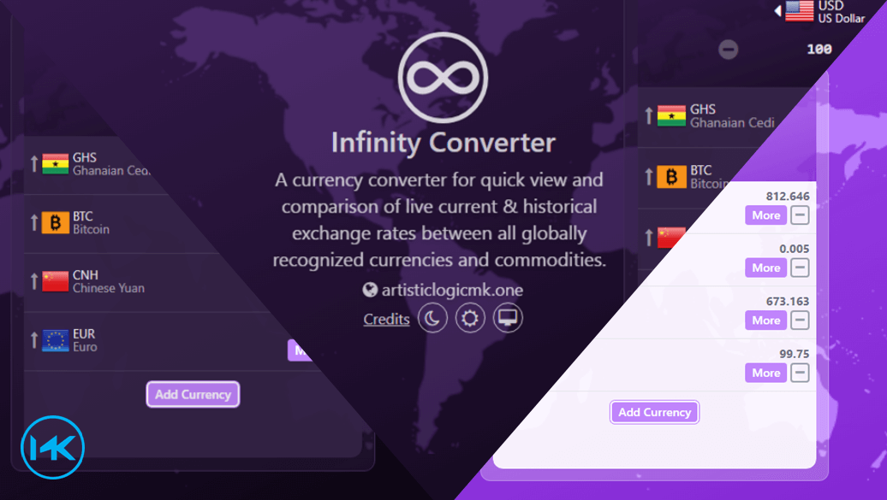

<p align="center"></p>

<h1 align="center">Infinity Currency Converter v2</h1>

<h3 align="center">
A currency converter for quick view and comparison of live current & historical exchange rates between all globally recognized currencies and commodities.
</h3>

<h3 align="center">
<a href="https://infinityconverter.netlify.app" target="_blank">Working Example</a> - <a href="https://exchangerate.host" target="_blank">Exchange Rate API</a>
<br>
<br>


<br/>
</h3>
<br>

## Project setup
```
npm install
```

### Compiles and hot-reloads for development
```
npm run serve
```

### Compiles and minifies for production
```
npm run build
```

### Customize configuration
See [Configuration Reference](https://cli.vuejs.org/config/).

<br>
Feel free to fork and contribute to this repository.

For any other concerns, email at <a href="mailto:mk.artisticlogic@gmail.com" target="_blank">mk.artisticlogic@gmail.com</a>.
